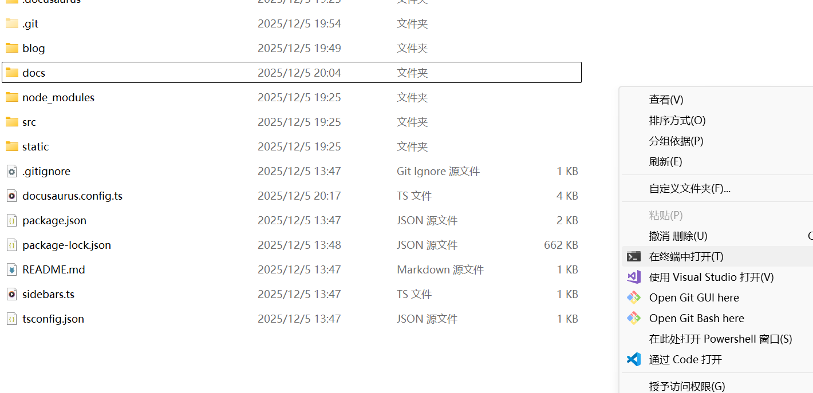

# 本地运行指南

这里记录如何在本地编辑并运行此维基百科。

<警告 内容="此方法需要Git技能以编辑维基。只是编辑的话，你无需这样做，最简单的编辑方式是获得编辑权限后，直接点击页面上的“编辑此页”按钮。"/>

## TLDR

```sh
git clone git@github.com:BeatSaberChineseWikiGroup/wiki.git
cd wiki
npm install
npm start
```

## 运行准备

<提示 内容="以下过程假设您使用Windows操作系统。"/>

- 安装[NodeJS](https://nodejs.org/zh-cn)，使用Windows安装程序(.msi)即可，维基是基于NodeJS来工作的。
- 安装[Git For Windows](https://git-scm.com/install/windows)，用于下载（修改、上传）维基内容文件。如果你的IDE带有Git功能并且能帮你下载这个维基，那就不用装了！
- 安装[VSCode](https://code.visualstudio.com/)。你也可以用你自己喜欢的代码编辑器，如果带有Git功能，而且你用过就最好了！
## 下载源码

找一个干净的文件夹，右键点击`Open Git Bash here`，并执行以下命令：

```sh
git clone git@github.com:BeatSaberChineseWikiGroup/wiki.git
```

你会看到新出现的wiki文件夹，进入它。

## 初始化项目及依赖

进入wiki文件夹，然后按住shift，点击鼠标右键，找到“在终端中打开”选项：

<提示 内容="如果没有找到也没关系，你也可以点击“在此处打开Powershell窗口”，然后输入cmd并按回车。"/>



输入以下指令，会自动下载并安装所有依赖：
<警告>如果出现错误，请检查[NodeJS](https://nodejs.org/zh-cn)是否安装。</警告>
```sh
npm install
```

## 运行项目

还是在上面的窗口中，执行`npm start`即可。浏览器访问[http://localhost:3000](http://localhost:3000)就能查看结果了。

`npm install` 在未来运行时无需重复执行。

## 编辑维基

直接使用你喜欢的IDE打开这个文件夹就能编辑。